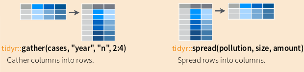
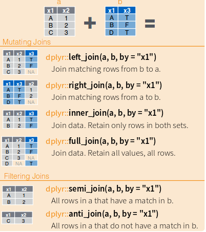

#R for Data Scouting and Wrangling

##Basic Syntax
###Objects and Vectors
```{r}
getwd()
x <- 1
y <- 3
z <- x + y

vector <- c(1, 3, 6, 9, 8)
vector2<- c(1,1,1,1,2)
vector_sumado <- vector+vector2
vector_sumado[1]
vector_sumado[8]
```
###Strings
```{r}
saludo <- "hola scout"
print(saludo)
saludos <- paste(saludo, "s", sep="")
print(saludos)
```


#Reading Data
csv, psv, xlsx, dbf

```{r}
df <- read.csv("../hw1_data.csv")

library(readxl)
df_xlsx <- read_excel("estatal.xlsx")

library(foreign)
df_dbf <-read.dbf("TSDem.dbf")
```

#Exploring Data

```{r}
dim(df)
str(df)
sum(is.na(df$Ozone))

colMeans(is.na(df[,]))
```
#Useful recodifications
dates & cvegeos

```{r}
env <- read.csv("envipe2015admin1.csv")
head(env$cvegeo)

env$cvegeo <- sprintf("%02d",env$cvegeo)
head(env$cvegeo)


time <- Sys.time()
print(time)
month <- format(time, "%b")
print(month)
year<- format(time, "%Y")
print(year)
num_month <- format(time, "%m")
print(num_month)
```
#dplyr

###Installation
```{r}
install.packages("dplyr")
library(dplyr)
```

###What is it?
"A fast, consistent tool for working with data frame like objects, both in memory and out of memory"
-CRAN

###What's new about it?
- verbs
- "grammar of data wrangling"
- new way of thinking about data manipulation
- efficient data storage backends

###What is it good for?


dplyr, using %>% passes the object on theleft hand side as the first argument of function on the right.


#Filter & Subset
```{r}
library(dplyr)

zacatecas <- env %>%
dplyr::filter(cvegeo == '32')


dim(zacatecas)
print(zacatecas)

col_insegura <- env %>%
dplyr::select(cvegeo, colonia_insegura)

dim(col_insegura)
print(col_insegura)
```

#Remove duplicates
```{r}
envipe_sin_duplicados <- env %>%
distinct()
```


#Making new columns
```{r}
env_mutated <- env %>%
dplyr::mutate(promedio_victimizacion = (victimizacion_hogar_b + victimizacion_hogar_a)/2)

env_mutated <- env %>%
dplyr::mutate(suma_sin_sentido = victimizacion_hogar_b + victimizacion_hogar_a)

#rankeo de filas
x <- dplyr::mutate_each(env, funs(min_rank))
```
#Summarise & Group by  
```{r}
env_sum <- summarise(env, avg = mean(victimizacion_hogar_a))
env_sum

env_sum <- env %>% 
dplyr::select(victimizacion_hogar_a,victimizacion_hogar_b,victimizacion_pers_b)%>%
summarise_each(funs(mean))

env_sum
```
#Reshape


```{r}
library(tidyr)
messy <- data.frame(
  estado = c("Aguascalientes", "Oaxaca", "Chiapas"),
  pobreza = c(67, 80, 64),
  desocupada = c(56, 90, 50)
)

long <- messy %>%
  gather(indicador, conteo, pobreza:desocupada)

wide <- long %>%
	spread(estado,conteo)

tidy <- long %>%
	spread(indicador,conteo)
```
#Merge/Join


```{r}
messy <- data.frame(
  estado = c("Aguascalientes", "Oaxaca", "Chiapas"),
  pobreza = c(67, 80, 64),
  desocupada = c(56, 90, 50)
)

catalogo <- data.frame(
	cvegeo = c("01","12","03","09"),
	estado = c("Aguascalientes","Oaxaca","Chiapas","DF"),
	pob_tot = c(10000, 40000, 50000,123785))

messy_con_metadata <- dplyr::full_join(messy,catalogo,by="estado")

messy_con_metadata <- dplyr::left_join(messy,catalogo,by="estado")

anti_joined <- dplyr::anti_join(catalogo,messy,by="estado")

```
#Putting it all Together with %>%

```{r}
library(nycflights13)
flights %>%
  group_by(year, month, day) %>%
  select(arr_delay, dep_delay) %>%
  summarise(
    arr = mean(arr_delay, na.rm = TRUE),
    dep = mean(dep_delay, na.rm = TRUE)
  ) %>%
  filter(arr > 30 | dep > 30)

```
#Making/Extracting Metadata

```{r}

```
#Sanity Checks
-suma de fechas
-agrupacion de cvegeos
-niveles de variables
-vacios
-comparacion a publicacion fuente

```{r}

```