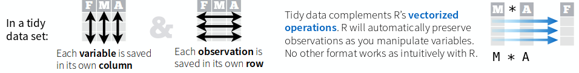

#R for Data Scouting and Wrangling

#Basic Syntax
##objects and vectors
```{r}
x <- 1
y <- 3
z <- x + y

vector <- c(1, 3, 6, 9, 8)
vector2<- c(1,1,1,1,2)
vector_sumado <- vector+vector2
vector_sumado[1]
vector_sumado[8]
```
##Strings
```{r}
saludo <- "hola scout"
print(saludo)
saludos <- paste(saludo, "s", sep="")
print(saludos)
```


#Reading Data
csv, psv, xlsx, dbf, 
```{r}

```

#Exploring Data (nas, shape, dim,plots, etc)

#Useful recodifications

#dplyr

###Installation
```{r}
install.packages("dplyr")
library(dplyr)
```

###What is it?
"A fast, consistent tool for working with data frame like objects, both in memory and out of memory"
-CRAN
###What's new about it?
- verbs
- "grammar of data wrangling"
- new way of thinking about data manipulation
- efficient data storage backends

###What is it good for?




#Making new columns

#Filter

#Reshape

#merge/join

#group by/summarise

#making metadata

#sanity checks


```{r}

```